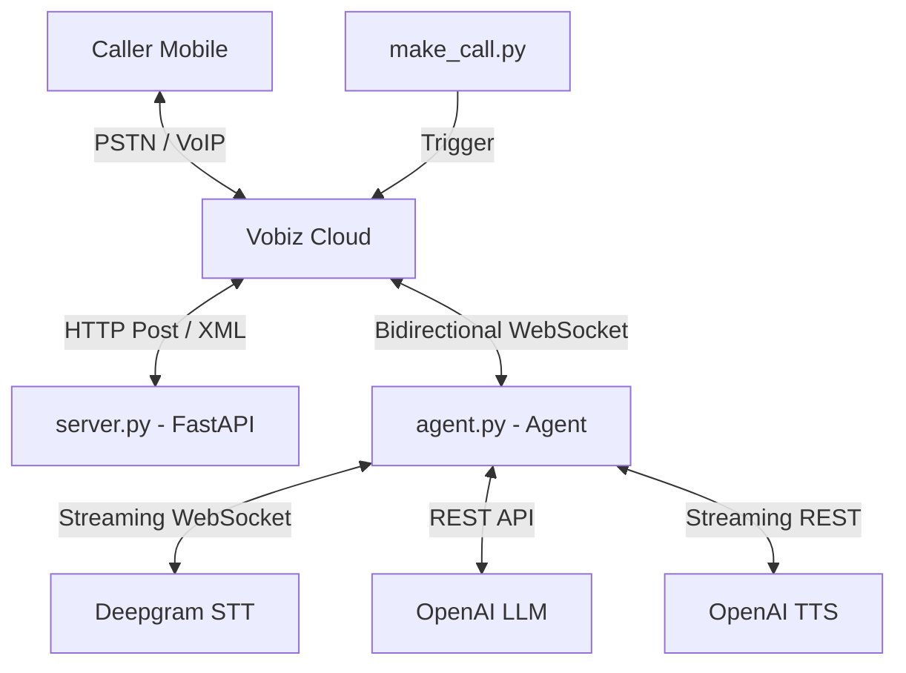

# 🤖 Vobiz AI Voice Agent: The Ultimate Technical Guide

A production-grade, low-latency AI voice agent implementation. This system bridges the gap between traditional PSTN (Public Switched Telephone Network) and modern AI Intelligence.

---

## 📑 Table of Contents
1. [Introduction](#1-introduction)
2. [High-Level Architecture](#2-high-level-architecture)
3. [The Orchestration Layer (server.py)](#3-the-orchestration-layer-serverpy)
4. [The Intelligence Layer (agent.py)](#4-the-intelligence-layer-agentpy)
5. [The Connectivity Layer (make_call.py)](#5-the-connectivity-layer-make_callpy)
6. [Vobiz Webhook Reference (HTTP)](#6-vobiz-webhook-reference-http)
7. [WebSocket Event Protocol (JSON)](#7-websocket-event-protocol-json)
8. [Audio Engineering & Math](#8-audio-engineering--math)
9. [Barge-in & Interruption Logic](#9-barge-in--interruption-logic)
10. [Setup & Installation](#10-setup--installation)
11. [Troubleshooting & FAQ](#11-troubleshooting--faq)

---

## 1. Introduction
The **Vobiz AI Voice Agent** is a "Human-in-the-Loop" style automation that allows an AI (OpenAI GPT-4o) to handle real phone calls. unlike standard IVRs (press 1 for support), this agent uses **Natural Language Understanding**. 

It converts sound to text (Deepgram), text to thought (OpenAI LLM), and thought back to sound (OpenAI TTS). It supports **Barge-in**, meaning if you interrupt the AI, it stops talking and listens—just like a human.

---

## 2. High-Level Architecture

### The Data Flow


### Protocol Stack
- **Telephony:** SIP/PSTN -> Vobiz XML Webhooks
- **Streaming:** WebSocket (WSS) -> JSON Encapsulated Audio
- **Transcription:** WebSocket -> Deepgram Nova-2
- **Synthesis:** HTTP Stream -> OpenAI TTS-1

---

## 3. The Orchestration Layer (`server.py`)

`server.py` acts as the gateway and security layer. Its primary jobs are:
- **Tunneling:** Starts `pyngrok` to provide a public endpoint for Vobiz.
- **Webhook Handling:** Responds to Answer/Hangup/Status requests from Vobiz.
- **WebSocket Proxy:** Routes WebSocket traffic from the public ngrok endpoint (port 5000) to the internal agent (port 5001).

### Internal Sequence of `server.py`:
1. **Startup:** Reads `.env`, initializes `ngrok`, and concurrently starts the FastAPI app and the `agent.py` server thread.
2. **Answer Event:** When Vobiz hits `/answer`, it fetches the active ngrok URL and builds the `<Stream>` XML.
3. **Proxy Logic:** Any connection hitting `/ws` is upgraded to a WebSocket and piped directly to the local agent loop.

---

## 4. The Intelligence Layer (`agent.py`)

`agent.py` is the stateful "brain" of the call. For every call, it spawns a `CallSession` object.

### The `CallSession` Lifecycle:
- **`__init__`**: Initializes conversation history with a system prompt.
- **`start_deepgram`**: Opens a raw WebSocket to Deepgram with the correct telephony headers.
- **`_listen_deepgram`**: A background task that stays open for the duration of the call, parsing JSON results from Deepgram and handling the "silence timer."
- **`handle_message`**: The main router for Vobiz events (`start`, `media`, `stop`).
- **`_play_audio`**: Chops synthesized audio into 20ms mu-law chunks and pushes them to Vobiz.

---

## 5. The Connectivity Layer (`make_call.py`)

A utility to automate the Vobiz REST API. It uses the `requests` library to send a `POST` to `https://api.vobiz.ai/v1/Account/{auth_id}/Call`.

**Key Feature: Auto-Discovery**
The script pings `http://localhost:5000/health` (the local `server.py`) to find the dynamically generated ngrok URL. This saves you from manually copy-pasting URLs every time you restart the project.

---

## 6. Vobiz Webhook Reference (HTTP)

Vobiz uses HTTP POST requests with `application/x-www-form-urlencoded` payloads.

### 6.1 Call Answer (`POST /answer`)
| Parameter | Description |
|-----------|-------------|
| `CallUUID` | Unique ID for the call session. |
| `From` | The caller's number. |
| `To` | The number being called. |
| `Direction` | `inbound` or `outbound`. |

**Expected XML Response:**
```xml
<Response>
    <Stream bidirectional="true" keepCallAlive="true">
        wss://your-ngrok-url/ws
    </Stream>
</Response>
```

### 6.2 Call Hangup (`POST /hangup`)
| Parameter | Description |
|-----------|-------------|
| `CallUUID` | Unique ID of the finished call. |
| `Duration` | Total length in seconds. |
| `HangupCause` | Why the call ended (`NORMAL_CLEARING`, `ORIGINATOR_CANCEL`, etc). |

**Note:** This is a status notification only. You cannot return XML here.

### 6.3 Stream Status (`POST /stream-status`)
| Parameter | Description |
|-----------|-------------|
| `Event` | `StartStream`, `StopStream`, or `PlayedStream`. |
| `StreamID` | Unique ID for the WebSocket session. |
| `Name` | The checkpoint name (only for `PlayedStream`). |

---

## 7. WebSocket Event Protocol (JSON)

Communications over the WebSocket use a JSON-framed binary protocol.

### 7.1 Events FROM Vobiz

#### `start`
The first packet sent. Provides context.
```json
{
  "event": "start",
  "streamId": "s-123",
  "callId": "c-456",
  "mediaServer": "vobiz-cloud-01"
}
```

#### `media`
Sent every 20ms. Contains raw caller audio.
```json
{
  "event": "media",
  "media": {
    "payload": "base64_encoded_8khz_mulaw_bytes",
    "track": "inbound"
  }
}
```

#### `playedStream`
An acknowledgement that the agent's voice reached the caller.
```json
{
  "event": "playedStream",
  "streamId": "s-123",
  "name": "greeting_checkpoint"
}
```

### 7.2 Commands TO Vobiz

#### `playAudio`
The primary way to "speak." 
```json
{
  "event": "playAudio",
  "media": {
    "contentType": "audio/x-mulaw",
    "sampleRate": 8000,
    "payload": "base64_encoded_8khz_mulaw_bytes"
  }
}
```

#### `clearAudio`
Interruption command. Stop playing everything in the buffer right now.
```json
{
  "event": "clearAudio",
  "streamId": "s-123"
}
```

#### `checkpoint`
A "marker" in the audio stream.
```json
{
  "event": "checkpoint",
  "streamId": "s-123",
  "name": "step_1_complete"
}
```

---

## 8. Audio Engineering & Math

Telephony audio is unique. We deal with **G.711 mu-law (PCMU)**.

### Why Mu-Law?
Standard 16-bit audio is linear. Mu-law is **logarithmic**. It compresses 14 bits of dynamic range into 8 bits by prioritizing the volume levels where human speech is most common. 

### The Conversion Algorithm in `agent.py`:
1. **Input:** OpenAI TTS yields 24,000Hz PCM 16-bit.
2. **Resampling:** We calculate the ratio (3:1) and pick every 3rd sample (roughly) using a linear interpolation logic:
   ```python
   # Simplistic view of the logic in resample_linear()
   ratio = from_rate / to_rate
   new_sample = samples[int(i * ratio)]
   ```
3. **Mu-Law Translation:**
   - Take the 16-bit sample (`-32768` to `32767`).
   - Add a bias of `33`.
   - Calculate the exponent and mantissa.
   - Bit-shift into a single 8-bit byte.

---

## 9. Barge-in & Interruption Logic

Barge-in makes an AI feel "real." Without it, the AI is a "radio" that won't stop playing even if you shout.

### How it works in this project:
1. **Audio Monitoring:** While the agent is playing its GPT response, it's simultaneously listening to the `media` events from the caller.
2. **STT Detection:** These events go to Deepgram.
3. **The Trigger:** As soon as Deepgram returns a "Final" transcript (not empty), `agent.py` detects this in `_on_deepgram_transcript`.
4. **The Action:** 
   - It fires `self._clear_audio()`.
   - This sends `clearAudio` to Vobiz.
   - Vobiz instantly stops playing the agent's voice.
   - The user's new question becomes the next input for GPT.

---

## 10. Setup & Installation

### Step-by-Step for Windows
1. **Install Python 3.11+**
2. **Extract Project** to a folder like `C:\VobizAgent`
3. **Open Terminal** (PowerShell or CMD)
4. **Setup Venv:**
   ```powershell
   python -m venv venv
   .\venv\Scripts\activate
   ```
5. **install Deps:**
   ```powershell
   pip install -r requirements.txt
   ```
6. **Configure .env:**
   - Copy `.env.example` to `.env`.
   - Fill in your `OPENAI_API_KEY` and `DEEPGRAM_API_KEY`.
   - Fill in Vobiz `AUTH_ID` and `AUTH_TOKEN`.
7. **Run Server:**
   ```powershell
   python server.py
   ```
8. **Test:**
   In another terminal, run `python make_call.py`.

---

## 11. Troubleshooting & FAQ

**Q: I get "ImportError: cannot import name 'LiveTranscriptionEvents'"**
A: This means your Deepgram SDK is out of date/incompatible. The current `agent.py` is fixed to avoid this by using raw WebSockets. Ensure you are using the latest version of `agent.py` provided in the repository.

**Q: ngrok tunnel fails to open**
A: Ensure you have run `ngrok config add-authtoken <YOUR_TOKEN>` on your machine first.

**Q: There is "dead air" after I speak**
A: Check the `asyncio.sleep(1.2)` in `_process_after_silence`. This is the silence detection threshold. If you want a faster response, lower it (e.g., `0.8`). If you want to allow naturally slow speakers, increase it (e.g., `1.5`).

**Q: Vobiz says "Webhook Error 500"**
A: This usually means the server crashed. Check the log in the `server.py` terminal for tracebacks. Most often this is due to a missing library like `python-multipart`.

---

## 📜 Complete Event Example: The "Greeting" Flow

1. **Vobiz -> Agent (start):** `{"event": "start", ...}`
2. **Agent -> Vobiz (playAudio):** (Chunk 1 of "Hello! How can I help?")
3. **Agent -> Vobiz (playAudio):** (Chunk 2...)
4. **Agent -> Vobiz (playAudio):** (Chunk 100...)
5. **Agent -> Vobiz (checkpoint):** `{"event": "checkpoint", "name": "greeting_sent"}`
6. **Vobiz -> Agent (playedStream):** `{"event": "playedStream", "name": "greeting_sent"}`

---

## 🏗️ Code Reference: Key Functions

### `agent.py`
- `CallSession.start_deepgram`: Orchestrates the raw `wss://` handshake.
- `CallSession._process_after_silence`: The decision-making hub.
- `generate_tts_audio`: Handles the heavy lifting of calling OpenAI TTS and doing the math conversions.

### `server.py`
- `answer_call`: Logic for finding the tunnel URL and generating XML.
- `VobizWSProxy`: A custom Starlette class that handles the `HTTP Upgrade` to WebSocket and pipes binary data.

---

## ⚖️ License & Credits
Developed for **Vobiz Telephony** integrations.
Powered by Deepgram, OpenAI, and Python FastAPI.

*Note: For production use, consider moving state management (conversation history) to a database like Redis/Postgres instead of in-memory dictionaries.*
